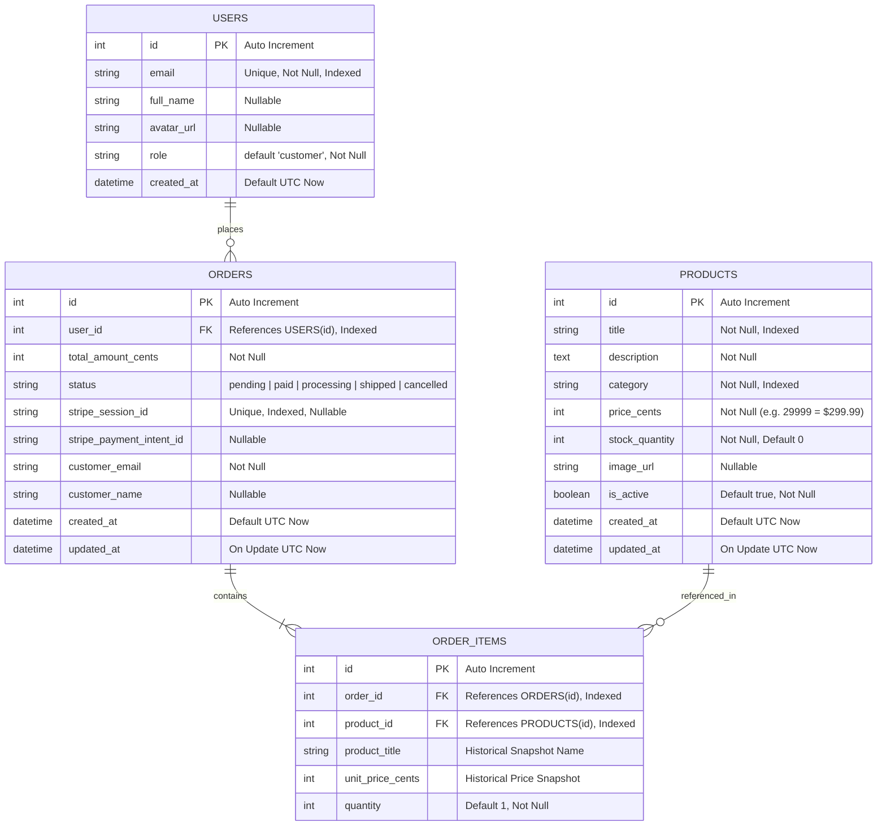

# Database Schema Specification

This document details the relational database design for the E-Commerce platform, engineered for transactional integrity (ACID), role-based security, and strict tenant order isolation.

---

## 1. Entity-Relationship (ER) Diagram



---

## 2. Table Specifications & Constraints

### 1. `users` Table
Stores registered customer accounts and system administrators.

| Column | Type | Constraints | Description |
|---|---|---|---|
| `id` | `INTEGER` | `PRIMARY KEY AUTOINCREMENT` | Unique identifier |
| `email` | `VARCHAR(255)` | `UNIQUE, NOT NULL, INDEXED` | User email from Google OAuth |
| `full_name` | `VARCHAR(255)` | `NULLABLE` | Display name |
| `avatar_url` | `VARCHAR(512)` | `NULLABLE` | Google profile photo URL |
| `role` | `VARCHAR(50)` | `NOT NULL, DEFAULT 'customer'` | RBAC role: `'customer'` or `'admin'` |
| `created_at` | `DATETIME` | `DEFAULT UTC NOW` | Account creation timestamp |

---

### 2. `products` Table
Stores the platform product catalog and real-time inventory counts.

| Column | Type | Constraints | Description |
|---|---|---|---|
| `id` | `INTEGER` | `PRIMARY KEY AUTOINCREMENT` | Unique SKU identifier |
| `title` | `VARCHAR(255)` | `NOT NULL, INDEXED` | Product title for display and search |
| `description` | `TEXT` | `NOT NULL` | Product specifications and copy |
| `category` | `VARCHAR(100)` | `NOT NULL, INDEXED` | Category classification (Audio, Displays, etc.) |
| `price_cents` | `INTEGER` | `NOT NULL, CHECK (price_cents >= 0)` | Stored in cents to eliminate floating-point rounding errors |
| `stock_quantity` | `INTEGER` | `NOT NULL, DEFAULT 0, CHECK (stock_quantity >= 0)` | Live inventory balance |
| `image_url` | `VARCHAR(512)` | `NULLABLE` | Product image URL |
| `is_active` | `BOOLEAN` | `NOT NULL, DEFAULT TRUE` | Soft-deletion flag |
| `created_at` | `DATETIME` | `DEFAULT UTC NOW` | Insertion timestamp |
| `updated_at` | `DATETIME` | `DEFAULT UTC NOW` | Last update timestamp |

---

### 3. `orders` Table
Stores customer orders, payment status, and Stripe session metadata.

| Column | Type | Constraints | Description |
|---|---|---|---|
| `id` | `INTEGER` | `PRIMARY KEY AUTOINCREMENT` | Order tracking ID |
| `user_id` | `INTEGER` | `FOREIGN KEY (users.id), NOT NULL, INDEXED` | Customer who placed order |
| `total_amount_cents`| `INTEGER` | `NOT NULL, CHECK (total_amount_cents >= 0)` | Total order value in cents |
| `status` | `VARCHAR(50)` | `NOT NULL, DEFAULT 'pending', INDEXED` | `'pending'`, `'paid'`, `'processing'`, `'shipped'`, `'cancelled'` |
| `stripe_session_id`| `VARCHAR(255)` | `UNIQUE, NULLABLE, INDEXED` | Stripe Checkout Session ID |
| `stripe_payment_intent_id` | `VARCHAR(255)` | `NULLABLE` | Stripe Payment Intent ID |
| `customer_email` | `VARCHAR(255)` | `NOT NULL` | Email recorded at time of order |
| `customer_name` | `VARCHAR(255)` | `NULLABLE` | Customer name recorded at time of order |
| `created_at` | `DATETIME` | `DEFAULT UTC NOW` | Placement timestamp |
| `updated_at` | `DATETIME` | `DEFAULT UTC NOW` | Status modification timestamp |

---

### 4. `order_items` Table
Stores snapshot records of line items purchased within an order.

| Column | Type | Constraints | Description |
|---|---|---|---|
| `id` | `INTEGER` | `PRIMARY KEY AUTOINCREMENT` | Item identifier |
| `order_id` | `INTEGER` | `FOREIGN KEY (orders.id), NOT NULL, INDEXED` | Associated parent order |
| `product_id` | `INTEGER` | `FOREIGN KEY (products.id), NOT NULL, INDEXED` | Referenced product SKU |
| `product_title` | `VARCHAR(255)` | `NOT NULL` | Historical snapshot of product title |
| `unit_price_cents` | `INTEGER` | `NOT NULL` | Historical purchase unit price in cents |
| `quantity` | `INTEGER` | `NOT NULL, DEFAULT 1, CHECK (quantity >= 1)` | Units purchased |

---

## 3. Data Integrity & Concurrency Controls
1. **Financial Precision**: All currency amounts (`price_cents`, `total_amount_cents`) are stored as **integers representing cents** rather than floating-point values, strictly preventing standard floating point inaccuracies in monetary arithmetic.
2. **Historical Price Immutability**: `order_items` retains `product_title` and `unit_price_cents` as point-in-time snapshots, preventing future price adjustments or product deletions from altering past receipts.
3. **Atomic Stock Decrementing**: Inventory adjustments upon successful Stripe payment execution are performed inside an atomic transaction block with optimistic concurrency safeguards:
   ```sql
   UPDATE products 
   SET stock_quantity = stock_quantity - :qty 
   WHERE id = :product_id AND stock_quantity >= :qty;
   ```
4. **Tenant Isolation**: Queries querying user orders are always strictly parameterized with `WHERE user_id = :current_user_id`, preventing unauthorized data access.
