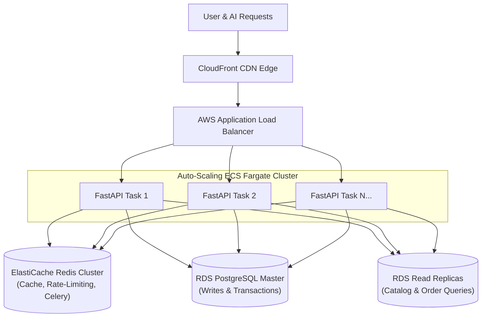
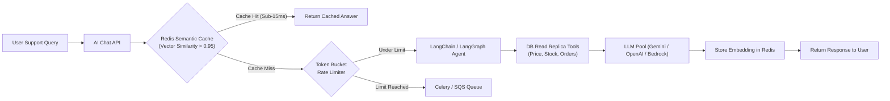

# Scaling Strategy: High User Load & AI Request Growth

This document details the architectural evolution and scaling strategy to handle a **100x to 10,000x increase** in active users, concurrent checkouts, and AI support agent inquiries.

---

## 1. Web & API Layer Scaling (FastAPI)

### A. Horizontal Auto-Scaling with Stateless Containers
* **ECS Fargate / Kubernetes (EKS)**: Deploy the FastAPI application as stateless Docker containers behind an Application Load Balancer (ALB).
* **Target Tracking Scaling Policies**: Scale container replicas automatically based on CPU utilization (>65%) and ALB Request Count per Target (>1,000 req/sec).
* **Connection Pooling**: Use **PgBouncer** or SQLAlchemy engine connection pools to efficiently multiplex thousands of concurrent ASGI connections into PostgreSQL.

### B. Read/Write Database Splitting
* E-commerce traffic is heavily read-dominant (~90% product browsing, ~10% cart/checkout writes).
* Route all catalog browsing (`GET /api/products`, `GET /api/products/{id}`) and order status lookups to **Amazon RDS Read Replicas**.
* Reserve the Primary Writer instance exclusively for transactional commits (Stripe webhooks, stock updates, order creation).

### C. Multi-Tiered Caching
* **Edge Caching**: AWS CloudFront caches static product assets and image variants globally.
* **In-Memory Redis Cache**: Cache the serialized active product catalog in ElastiCache Redis. Use TTL-based invalidation with pub/sub purge triggers whenever an admin modifies a product.

---

## 2. Scaling AI Support Agent & LLM Request Volume

When AI requests scale into hundreds of thousands per hour, direct synchronous LLM calls cause severe bottlenecks: LLM API rate limits (TPM/RPM), prohibitive token latency (2–5 seconds per call), and runaway costs. We resolve this through four distinct architectural mechanisms:

### 1. Semantic Embedding Caching with Redis Vector Search
* Over 70% of customer support questions are repeated variations (e.g., *"What is the price of the AeroPro headphones?"*, *"How much do AeroPro headphones cost?"*).
* Instead of invoking an external LLM for every request, compute an embedding of the customer query and perform a fast cosine-similarity search against Redis Vector Store.
* If a semantically equivalent query was answered within the TTL window (e.g. cosine distance < 0.05), return the cached answer in **under 15ms**, bypassing the LLM entirely and saving up to 80% on token fees.

### 2. Deterministic Tool Routing Before LLM Fallback
* Standard tool-calling agents often route simple queries through an expensive LLM just to decide to call a tool.
* Implement a **lightweight intent classifier** (fast pattern matching or a distilled 0.5B parameter local model) to directly invoke backend SQL tools for exact catalog matching before escalating complex queries to frontier LLMs.

### 3. Asynchronous Worker Queues & WebSockets (Celery + Redis / SQS)
* For intensive agent workflows or during peak traffic spikes (e.g., Black Friday):
  - Transition chat from synchronous HTTP POST to **FastAPI WebSockets** with token streaming (`Server-Sent Events` / `SSE`).
  - Offload agent orchestration tasks to distributed worker queues powered by **Celery** or **AWS SQS**.
  - Stream tokens directly to the user as they are generated, providing immediate sub-500ms time-to-first-token (TTFT) perception.

### 4. Multi-Provider Fallback & Token Budgeting
* Implement a dynamic LLM gateway that balances across multiple providers (e.g., Google Gemini 1.5 Flash, OpenAI GPT-4o-mini, Anthropic Claude 3.5 Haiku, and AWS Bedrock).
* If a primary provider experiences downtime or rate limits (HTTP 429), automatically failover to secondary endpoints within 200ms.
* Apply token bucket rate limiting per user (e.g., 20 messages / 10 minutes) to protect against denial-of-wallet attacks.
