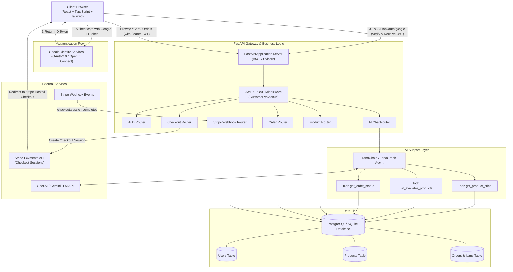
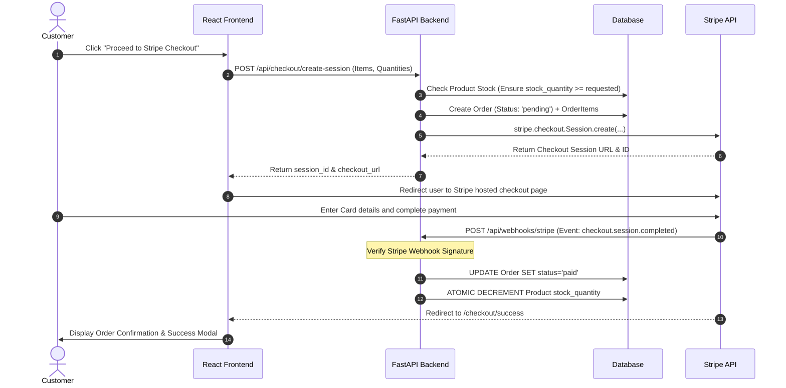
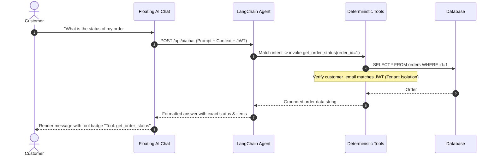
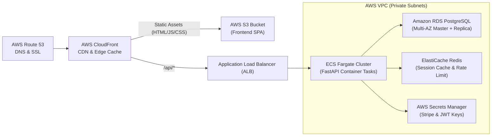

# System Design: Mini AI E-Commerce Platform

This document presents the end-to-end architectural system design for the Mini AI E-Commerce application, covering data flows, component relationships, authentication security, payment lifecycle, AI grounding, and AWS deployment.

---

## 1. High-Level Architecture Diagram

---

## 2. Core Flows & Sequences

### A. Authentication & Session Flow
1. **Frontend Trigger**: User clicks "Sign In with Google" via Google Identity Services button.
2. **Google Authentication**: Google popup authenticates user and returns an asymmetric signed `id_token` (JWT).
3. **Backend Verification**: Frontend transmits `id_token` to `POST /api/auth/google`.
4. **FastAPI Verification**: FastAPI uses `google-auth` to fetch Google's public JWKS keys and verify signature, audience (`GOOGLE_CLIENT_ID`), and expiry.
5. **Database Upsert**: If user email is new, a record is created in `users` with default role `customer`. If existing, profile is updated.
6. **JWT Issuance**: FastAPI issues a signed HMAC-SHA256 JWT containing `sub` (user_id), `email`, and `role`.
7. **Protected API Access**: Client passes `Authorization: Bearer <jwt>` with every request. FastAPI dependency `require_admin` ensures only admins can access administrative routes.

---

### B. Stripe Checkout & Payment Lifecycle

---

### C. AI Support Agent Tool Calling Flow

---

## 3. Role-Based Access Control (RBAC) Matrix

| Endpoint | Method | Role Allowed | Behavior |
|---|---|---|---|
| `/api/products` | GET | Public (Everyone) | View active catalogue |
| `/api/products/{id}` | GET | Public (Everyone) | View single product specs |
| `/api/products` | POST | **Admin Only** | Create product (403 if Customer) |
| `/api/products/{id}` | PUT | **Admin Only** | Edit product details & stock (403 if Customer) |
| `/api/products/{id}` | DELETE | **Admin Only** | Deactivate product (403 if Customer) |
| `/api/orders/my-orders` | GET | **Customer / Admin** | Strict Tenant Isolation: User's own orders |
| `/api/orders/{id}` | GET | **Owner or Admin** | View single order |
| `/api/admin/orders` | GET | **Admin Only** | View orders across all customers |
| `/api/admin/orders/{id}/status`| PATCH | **Admin Only** | Update shipment/delivery status |
| `/api/checkout/create-session`| POST | Authenticated User | Validate stock & create pending order |
| `/api/webhooks/stripe` | POST | Stripe Webhook Server | Verify signature & finalize order |
| `/api/ai/chat` | POST | Public / Authenticated | Grounded AI queries with user tenant guard |

---

## 4. Production AWS Deployment Approach

* **Frontend**: Built as static bundle and distributed via **Amazon S3** fronted by **AWS CloudFront** edge network for sub-30ms global latency.
* **Backend**: Dockerized FastAPI container running on **AWS ECS Fargate** with auto-scaling based on CPU/Request count.
* **Database**: **Amazon RDS PostgreSQL** (Multi-AZ with automated backups and read replica).
* **Cache & Rate Limiting**: **Amazon ElastiCache (Redis)** for LLM semantic query caching and API rate limiting.
* **Secrets Management**: **AWS Secrets Manager** for secure injection of Stripe and Google client credentials into task containers.
